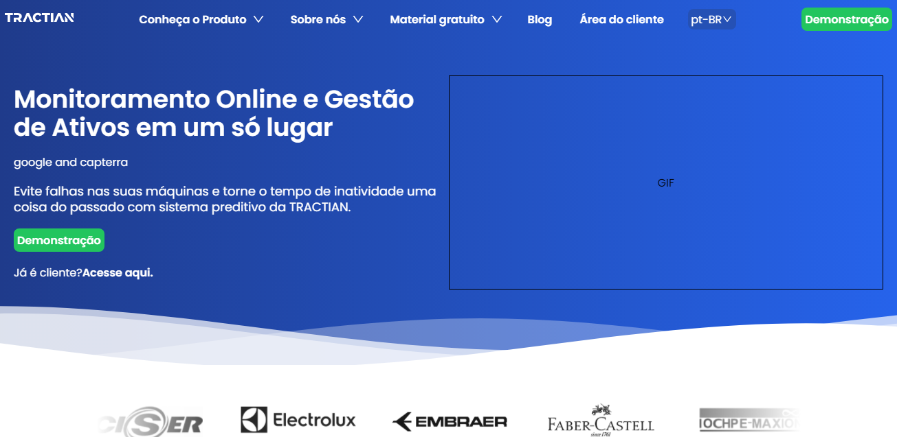

<div align="center" id="top"> 
  
</div>

<hr/>
<br>

## About

This application is my challenge for tractian's company.

## Screenshots

<div align="center" id="top"> 
  
</div>
<br/>

## Deploy

To see this code running in production access [here](https://tractian-challenger-thiago-nqaj2s5zd-thiago-spart.vercel.app/pt-BR)

## Features

- Multiple languages.
- Responsive.
- Easy to understand and change.

## Technologies

The following tools were used in this project:

- [React](https://pt-br.reactjs.org/)
- [TypeScript](https://typescriptlang.org/)
- [Next](https://nextjs.org)
- [I18Next](https://i18next.com)
- [Styled components](https://styled-components.com/)

## Requirements

Before starting 🏁, you need to have [Git](https://git-scm.com), [Node](https://nodejs.org/en/) and [Yarn](https://yarnpkg.com) installed.

## Starting

```bash
# Clone this project
$ git clone https://github.com/Thiago-spart/tractian-challenger

# Access
$ cd tractian-challenger

# Install dependencies
$ yarn

# Run the project in developer mode
$ yarn dev

# The server will initialize in the <http://localhost:3000>
```

## License

This project is under license from MIT. For more details, see the [LICENSE](LICENSE.md).

Made with ❤️ and ☕ by <a href="https://github.com/Thiago-spart" target="_blank">Thiago Moraes</a>

&#xa0;

<a href="#top">Back to top</a>
